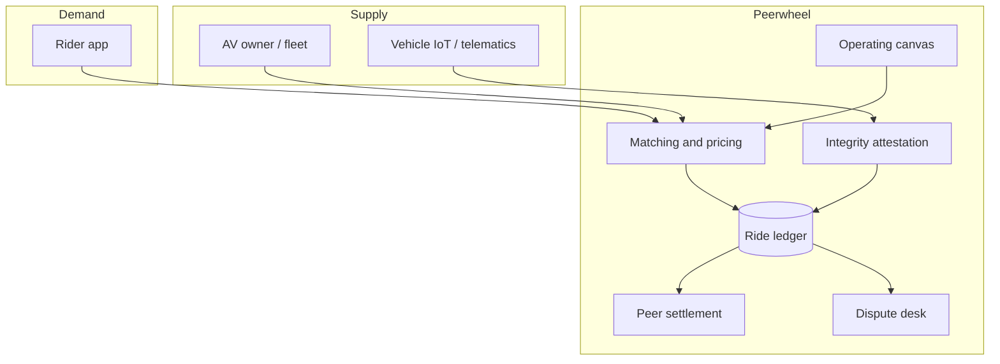

# Peerwheel

**Source:** `ai-in-decentralized+ai/business-models-based-on-blockchain-ai-iot/`
**Domain:** `ai-decentralized`
**One-liner:** A peer-to-peer autonomous vehicle sharing desk that matches idle AV owners with riders, settles rides without a payment middleman, and proves vehicle integrity from IoT telemetry when disputes arise.
**Wedge:** Early AV fleet operators and private AV owners in one metro corridor who already run sensor-rich vehicles and want Uber-like utilisation without PayPal/bank float delays — starting with on-demand C2C rides priced comparable to taxi, not full OEM manufacturing.
**Positioning:** Convergence ops for IoT + AI + blockchain mobility. Jin Liu’s Uppsala thesis argues the three technologies only become a business when mapped onto Osterwalder’s canvas; the worked incision point is blockchain-settled self-driving car sharing (IoT connectivity, AI autonomy, ledger payments and dispute history). Peerwheel productises that canvas — not a generic “smart city platform.”

## Market research synthesis

### Thesis from source

The thesis frames IoT, AI, and blockchain as the next technological epoch that will create GAFA-scale winners and strand firms that ignore the synergy. IoT is positioned as the connectivity fabric (Gartner’s 20.8B connected devices by 2020; smart city, home, healthcare, manufacturing examples), AI as automation and pattern learning, and blockchain as the trust layer that removes payment middlemen and makes transaction history legible for legal disputes. The commercially sharp chapter is not the technology primers — it is the convergence example: a blockchain DApp linking self-driving car owners and passengers in a C2C sharing model, analogous to Uber but with peer settlement, transparent ride history, digital-currency payment, and vehicle-security claims rooted in the value-proposition canvas (trustworthy ride, on-demand service, spare-resource income, comparable taxi pricing).

Empirical interviews with six ICT practitioners (China; mix of blockchain, e-commerce, AI, IoT, electronics) ranked blockchain highest for entrepreneurial potency, then AI, then IoT — while insisting the opportunity sits in compound patterns rather than single technologies. On business-model design, value proposition and channels ranked as the most significant canvas blocks; key resources, customer segments, and key activities formed the second tier; cost structure and revenue streams ranked lowest because early entrepreneurs systematically mis-forecast costs (one interviewee expected website maintenance to dominate and instead faced payroll for fifty staff). Regression on the value-proposition canvas confirmed that value proposition and customer segments rise together and must be modelled as a pair. Timing and dynamic updates of the canvas are treated as first-class survival factors; first-mover advantage is explicitly not assumed to win.

### Buyer & economic model

- **Primary buyer:** Head of Mobility / Fleet Product at an AV operator or mobility startup launching C2C AV sharing in one city.
- **Users:** vehicle owners and fleet dispatchers (supply), riders (demand), settlement ops, vehicle-security analysts, dispute mediators, city partnership managers.
- **Budget owner / value metric:** utilisation of idle AV hours and cost per settled ride versus incumbent ride-hail (taxi-comparable price with faster peer payout and lower dispute leakage).
- **Competing status quo:** Uber/DiDi-style platforms with bank/PayPal settlement float, opaque dispute history, and no cryptographic vehicle-integrity evidence when liability questions arise.

### Domain constraints

- **Regulatory / trust / safety:** autonomous vehicle liability, passenger safety, local transport licensing, and crypto-payment legality vary by jurisdiction; ledger transparency must support legal disputes without exposing unnecessary personal data.
- **Data sensitivity:** ride routes, passenger identities, and continuous vehicle telemetry are highly sensitive; IoT security signals must prove integrity without broadcasting raw cabin or location streams to counterparties.
- **Change-management realities:** operators will not manufacture AVs (thesis: use outer AV resources); Peerwheel must integrate existing fleet telematics and payment rails while phasing peer settlement beside fiat off-ramps.

## Business requirements

- BR-1: Every completed ride must settle peer-to-peer (or via disclosed escrow) without a mandatory payment middleman float that delays owner payout beyond a published SLA.
- BR-2: Ride records must be dual-readable by owner and rider for a defined dispute window, with an append-only history suitable for legal trace-back as the thesis requires.
- BR-3: Vehicle integrity attestations from IoT sensors (lock, location heartbeat, critical fault flags) must be bindable to each ride before payout unlocks when a security hold is raised.
- BR-4: Matching must optimise for on-demand availability in sparse taxi zones while keeping rider price comparable to local taxi benchmarks published on the corridor.
- BR-5: Value proposition and customer segments must be configurable as a paired canvas object so operators can re-fit offer to segment without orphaning either side (per regression finding).
- BR-6: Channel performance (app, partner OEM deep-link, corporate travel) must be measurable as a first-class KPI, reflecting interviewee ranking of channels.
- BR-7: Owners must see expected net yield per idle hour before listing a vehicle, including fees disclosed as a single line.
- BR-8: Digital-currency payment may be offered where lawful, but fiat settlement must remain available so the wedge is not blocked by crypto adoption.
- BR-9: Disputes (no-show, unsafe vehicle flag, fare disagreement) must time-box to a documented resolution with evidence from the ride ledger and IoT attestations.
- BR-10: The operator must be able to pause a corridor or vehicle class when regulation or safety events require it without rewriting settled history.
- BR-11: Cost and revenue assumptions in the operating canvas must be revisable monthly; the system must surface variance versus plan so static canvases do not silently fail.
- BR-12: Personal ride data retention must support dispute and regulatory windows then minimise; telemetry used for integrity proofs must be purpose-limited.

## User stories

Canonical user stories live in sibling [USER_STORIES.md](USER_STORIES.md).

## System design

### Overview

Peerwheel is the operating system for a blockchain-settled AV sharing corridor. Owners publish availability windows; riders request rides; matching assigns a vehicle; IoT agents emit integrity attestations bound to the ride; settlement executes peer-to-peer (with optional fiat off-ramp); disputes open against the append-only ride ledger. A lightweight canvas module keeps value proposition, segments, and channels as living operating objects rather than a slide deck.

### Actors & boundaries

- **Actors:** AV owners/fleet ops, riders, settlement ops, dispute mediators, city/compliance, platform operator.
- **Trust boundary:** ride ledger and integrity attestations are the shared evidence plane; raw cabin/video streams stay in owner systems; Peerwheel stores proofs, hashes, and settlement states.
- **Human-in-the-loop points:** safety holds, dispute adjudication, corridor pause, canvas re-fit approvals.

### Core capabilities

1. **Vehicle and availability listing** — register AV assets, sensors, licensing tags, idle windows.
2. **Ride matching and pricing** — on-demand match with taxi-benchmark pricing bands.
3. **IoT integrity attestation** — bind pre/during/post-ride security signals to the ride record.
4. **Peer settlement** — peer (or escrow) payout with disclosed platform fee and optional fiat rail.
5. **Dispute desk** — time-boxed cases with ledger + attestation evidence.
6. **Corridor and safety controls** — pause classes, recalls, licensing gates.
7. **Operating canvas** — paired value proposition / segment fit plus channel and cost variance metrics.
8. **Reporting and audit export** — ride, settlement, and dispute packs for legal and partner review.

### Conceptual data

- **Primary entities:** Vehicle, Owner, Rider, AvailabilityWindow, Ride, IntegrityAttestation, Settlement, Dispute, Corridor, CanvasFit, ChannelMetric.
- **Critical events:** vehicle listed, ride matched, attestation failed/passed, settlement executed, dispute opened/resolved, corridor paused, canvas revised.
- **Retention / audit needs:** ride and settlement history for dispute and tax windows; telemetry proofs retained as hashes with short-lived raw samples only when a case is open.

### Integrations (conceptual)

- **Systems of record:** fleet telematics / OEM APIs, rider identity/KYC, fiat payment off-ramps, municipal licensing registries.
- **Upstream signals:** IoT lock/fault/heartbeat sensors, traffic/ETA feeds, taxi price benchmarks.
- **Downstream actions:** dispatch instructions to AV stack, payout execution, dispute notices, corridor pause broadcasts.

### High-level architecture

### Success metrics

- **Leading:** median owner payout time versus bank float baseline; pre-ride attestation pass rate; share of rides with dual-readable receipts; canvas re-fit cadence.
- **Lagging:** idle-hour utilisation; verified cost per ride versus taxi benchmark; dispute rate and time-to-resolve; corridor retention of owners and riders.

## OpenAPI skeleton

Canonical HTTP surface lives in sibling [openapi.yaml](openapi.yaml). Summary:

- **Base path:** `/v1/...`
- **Auth:** `X-API-Key` for telematics and settlement integrations; Bearer JWT for operators.
- **Resource groups:** Vehicles, Rides, Attestations, Settlements, Disputes, Canvas.
