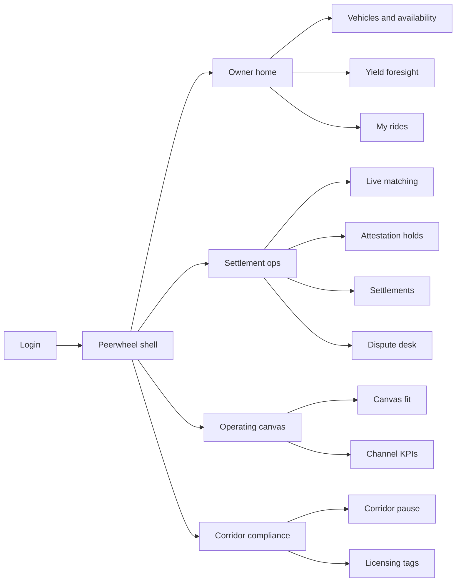
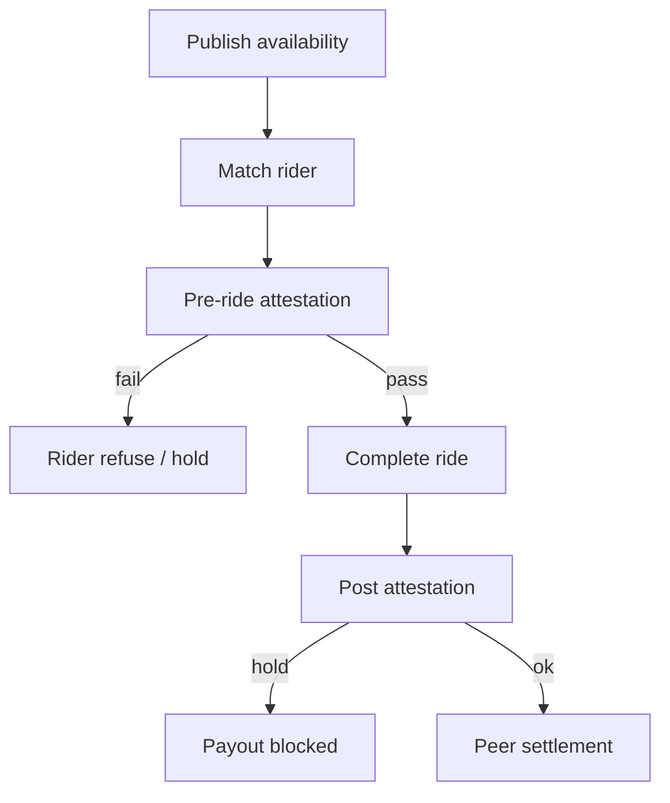

# Peerwheel — Web app

**Product:** [PRODUCT.md](./PRODUCT.md)
**Primary surface:** Dual-sided AV corridor console (Owner/fleet workspace + Ops settlement under one Peerwheel shell)
**Secondary surfaces:** Rider receipt / dispute evidence viewer (lightweight); corridor pause status page for city partners
**Design thesis:** Peerwheel is a peer-settlement wheel for idle AVs — not a ride-hail growth dashboard. The UI metaphor is a corridor control room with a spinning utilisation wheel: idle hours convert to settled rides only when IoT integrity attestations unlock payout. Visual language is night-asphalt graphite with yield-lime for settled peer payouts and fault-amber for integrity holds. The brand wordmark sits as a quiet hub mark on every money- and safety-bearing screen so owners and city partners know whose ledger they are trusting.

## UX research synthesis

### Category peers (best-in-class)

- **Uber / DiDi fleet and driver apps:** On-demand matching, earnings clarity, safety holds. Steal: expected net yield before listing; reject multi-day payment float as the default settlement story.
- **Turo / Getaround host dashboards:** Idle-asset listing, utilisation economics, damage claims with evidence. Steal: owner yield foresight and pull-from-marketplace; reject human-driver trip UX where Peerwheel needs AV integrity attestations.
- **Tesla Fleet / OEM telematics consoles:** Fault flags, lock/heartbeat health. Steal: pre-ride integrity gate bound to payout; reject broadcasting raw cabin/location streams to counterparties.
- **Crypto exchange dispute / escrow desks (Coinbase case UX patterns):** Append-only case files, dual-party evidence. Steal: dual-readable ride ledger for dispute windows; reject speculative token UI as the primary mobility home.

### Patterns to adopt / reject

- **Adopt:** Peer payout SLA clock; integrity attestation chips on every ride; taxi-benchmark price band; paired canvas (value proposition ↔ segment); disclosed fee line; corridor pause without rewriting history; purpose-limited telemetry proofs.
- **Reject:** Surge-first vanity maps; opaque dispute screenshots; mandatory crypto-only payments; purple “smart city” glow; dashboard-of-everything that buries settlement.

### Trust, density, and workflow constraints from PRODUCT.md

Settlement must beat bank float SLA (BR-1) with dual-readable append-only history (BR-2). Integrity attestations can block payout (BR-3). Matching keeps taxi-comparable pricing (BR-4). Canvas VP+segment stay paired (BR-5); channels are first-class KPIs (BR-6). Owners see net yield with disclosed fees (BR-7). Fiat always available beside lawful crypto (BR-8). Disputes time-box with ledger + IoT evidence (BR-9). Corridor/vehicle pause is non-destructive (BR-10). Canvas cost/revenue variance is monthly (BR-11). Telemetry is purpose-limited (BR-12).

## Information architecture

### Nav model

### Roles → default home

| Role | Default home | Why |
|------|--------------|-----|
| AV owner / fleet dispatcher | Owner home — idle yield + listings | Utilisation economics (BR-7) |
| Settlement operator | Settlement + attestation holds | Payout unlock (BR-1, BR-3) |
| Dispute mediator | Dispute desk | Legal trace-back (BR-2, BR-9) |
| Mobility product lead | Operating canvas | VP ↔ segment + channels (BR-5, BR-6) |
| City / compliance | Corridor pause + licensing | Safety and rules (BR-10, BR-12) |

### Cross-links to OpenAPI resources

| Nav area | OpenAPI tags / resources |
|----------|---------------------------|
| Vehicles, availability | Vehicles |
| Matching, ride lifecycle | Rides |
| IoT integrity proofs | Attestations |
| Peer payouts | Settlements |
| Dispute cases | Disputes |
| VP/segment/channels/variance | Canvas |

## Screen inventory

### Owner home

- **Purpose:** Answer “what is my expected net yield if I list idle hours now?” in one composition.
- **Entry:** Owner/fleet login default.
- **Layout regions:** Brand + corridor switcher; yield foresight (net/hour after fee line); active availability; open attestation holds; recent settlements vs float SLA.
- **Primary actions:** Publish availability; pull vehicle; open ride receipt.
- **Empty / loading / error:** Empty = register first AV + sensors; error = telematics disconnect.
- **BR / story ties:** BR-7, BR-1; owner stories.

### Vehicles and availability

- **Purpose:** Register AV assets, licensing tags, sensor bindings, and idle windows.
- **Entry:** Owner nav.
- **Layout regions:** Vehicle list; licensing tags; sensor health; availability calendar; instant pull control.
- **Primary actions:** List window; pull from marketplace; update licensing.
- **Empty / loading / error:** Missing sensors block listing; recall pause inherited from corridor.
- **BR / story ties:** BR-3, BR-10; dispatcher recall story.

### Live matching and pricing

- **Purpose:** On-demand match with taxi-benchmark bands in sparse zones.
- **Entry:** Ops; corridor map deep link.
- **Layout regions:** Corridor map (availability density); price band vs local taxi; match queue; channel source chip (app/OEM/corporate).
- **Primary actions:** Manual reassign (ops exception); publish price band.
- **Empty / loading / error:** Sparse supply = wait ETA with taxi compare; never hide benchmark.
- **BR / story ties:** BR-4, BR-6.

### Integrity attestation desk

- **Purpose:** Bind lock/heartbeat/fault proofs to rides; block payout on security holds.
- **Entry:** Ops default for security analysts; ride detail.
- **Layout regions:** Hold queue; proof summary (hash, purpose tag — not raw stream); pass/fail pre/during/post; unlock controls.
- **Primary actions:** Clear hold; keep hold; open dispute.
- **Empty / loading / error:** Empty = healthy corridor message; failed pre-ride = rider refuse affordance noted.
- **BR / story ties:** BR-3, BR-12; rider refuse story.

### Settlements

- **Purpose:** Peer (or escrow) payout with disclosed fee and fiat/crypto rail choice.
- **Entry:** Ops finance; owner settlements shortcut.
- **Layout regions:** Settlement table (SLA clock vs bank float baseline); fee line; rail (fiat/crypto); integrity unlock dependency.
- **Primary actions:** Execute payout; retry rail; export remittance.
- **Empty / loading / error:** Held = amber until attestation clear; crypto rail disabled where unlawful.
- **BR / story ties:** BR-1, BR-8.

### Dispute desk

- **Purpose:** Time-boxed cases with dual-readable ledger + IoT attestations.
- **Entry:** Alerts; ride receipt action.
- **Layout regions:** Queue with deadline; dual evidence panes (owner/rider); append-only history; resolution log.
- **Primary actions:** Resolve; extend within policy; export case pack.
- **Empty / loading / error:** Empty = no open disputes; expired = locked resolution.
- **BR / story ties:** BR-2, BR-9.

### Operating canvas

- **Purpose:** Keep value proposition and customer segments as a paired living object; show channel KPIs and cost variance.
- **Entry:** Strategy default.
- **Layout regions:** Paired VP ↔ segment editor; channel performance; monthly cost/revenue vs plan; revision history.
- **Primary actions:** Propose re-fit; approve; publish to matching constraints.
- **Empty / loading / error:** Orphaned VP without segment blocked; variance coral when payroll-class overruns.
- **BR / story ties:** BR-5, BR-6, BR-11.

### Corridor pause and licensing

- **Purpose:** Pause corridor or vehicle class without rewriting settled history.
- **Entry:** City/compliance home.
- **Layout regions:** Pause controls; affected classes; licensing registry tags; broadcast status.
- **Primary actions:** Pause/resume; tag vehicles; notify owners.
- **Empty / loading / error:** Active pause banner on all supply screens.
- **BR / story ties:** BR-10.

### Ride receipt (secondary)

- **Purpose:** Dual-readable receipt for riders/owners suitable for disputes.
- **Entry:** Post-ride; deep link.
- **Layout regions:** Fare, fee line, attestation summary, ledger refs; dispute CTA within window.
- **Primary actions:** Download; open dispute.
- **Empty / loading / error:** Outside retention = minimised stub.
- **BR / story ties:** BR-2, BR-12.

## Key flows

1. **List → match → attest → settle** — publish idle window → match → pre-ride attestation → complete → peer payout; failure: attestation hold blocks payout.

2. **Dispute** — open case → dual evidence → time-box resolve (BR-9).

3. **Safety pull** — recall/pause vehicle class → marketplace pull → settled history unchanged (BR-10).

4. **Canvas re-fit** — edit VP+segment together → channel KPIs update → matching constraints publish (BR-5, BR-6).

5. **Yield foresight** — owner reviews net/hour + fee line → lists hours (BR-7).

## Design system

### Tokens (CSS variables)

- `--color-ink: #E8EDF2` — primary text
- `--color-asphalt-950: #0B0F14` — app ground
- `--color-asphalt-900: #151B24` — panels
- `--color-asphalt-700: #2C3644` — dividers
- `--color-yield: #A8D45A` — settled payout / utilisation
- `--color-yield-dim: #4F6B28` — yield on dark
- `--color-amber: #E0A04A` — integrity hold / dispute
- `--color-coral: #E85D4C` — safety pause / failed attestation
- `--color-steel: #7A8FA3` — secondary labels
- `--color-brand: #C5D99A` — Peerwheel wordmark
- `--font-display: "Space Grotesk", sans-serif`
- `--font-mono: "JetBrains Mono", monospace` — ride ids, attestation hashes
- `--space-1`…`--space-8`: 4px scale
- `--radius-sm: 4px`; `--radius-md: 8px`
- `--motion-settle: 180ms ease-out` — payout confirm
- `--motion-hold: 240ms ease-in-out` — amber hold pulse
- `--motion-wheel: 320ms ease-out` — utilisation wheel tick
- Atmosphere: subtle radial “wheel” grid on asphalt-900; cool night gradient — not purple smart-city neon.

### Typography & brand

- Display for yield numerals and corridor titles; mono for ride/attestation ids.
- Brand wordmark on settlement and attestation screens.
- Login: brand hero; headline (“Settle the ride when the vehicle proves out”); one CTA.

### Do / don’t

- **Do:** Show fee as one line; bind attestation to payout; pair VP with segment; keep fiat available.
- **Don’t:** Crypto-only wedge; raw telemetry broadcast; editable settled rides; surge vanity as home.

### Accessibility & domain trust cues

- AA+ contrast; holds never colour-only.
- Live regions for pause and payout SLA breaches.
- Focus: vehicle → match → attest → settle → dispute.

## Component patterns

- **YieldForesightPanel** — net/hour with disclosed fee.
- **AttestationHoldChip** — blocks settlement until cleared.
- **TaxiBenchmarkBand** — price vs local taxi corridor.
- **PeerPayoutSlaClock** — vs bank float baseline.
- **DualRideLedger** — owner/rider dual-readable history.
- **PairedCanvasEditor** — VP ↔ segment locked pair.
- **CorridorPauseBanner** — non-destructive safety control.
- **PurposeLimitedProof** — integrity hash without raw stream.

## Out of scope for v1 web

- OEM AV manufacturing; full city OS / smart-city suite; cabin video review studio; consumer social feed; multi-metro expansion tooling beyond one corridor; replacement of municipal licensing systems.
